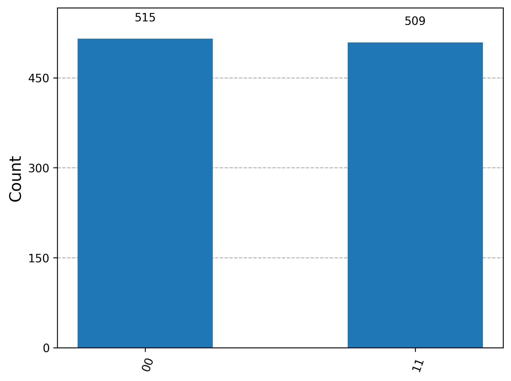

# quantum-circuit-h-cnot
This notebook demonstrates how to create a Bell state (entangled quantum state) using Qiskit. It applies Hadamard and CNOT gates on 2 qubits, simulates execution on qasm_simulator, and visualizes the measurement outcomes. Concepts: quantum superposition, entanglement, and measurement collapse.

---

# 🔗 Bell State Quantum Circuit using Qiskit

This repository contains a simple quantum circuit built using [Qiskit](https://qiskit.org/) that demonstrates **superposition** and **entanglement** using a Hadamard gate followed by a CNOT gate. The final circuit produces a Bell state, and its output is simulated using the QASM simulator from `qiskit-aer`.

---

## 🧠 Project Description

In this project, we construct a quantum circuit with:

- **2 qubits** (quantum bits)
- **2 classical bits**

The circuit performs the following operations:

1. **Hadamard Gate (H)** is applied on qubit 0 to place it in superposition.
2. **CNOT Gate** is applied with qubit 0 as control and qubit 1 as target, creating entanglement between them.
3. **Measurement** is performed on both qubits and stored in classical bits.

The final quantum state collapses into either **|00⟩** or **|11⟩** with equal probability, demonstrating the behavior of a **Bell state (Φ⁺)**.

---

## 🛠️ Technologies Used

- **Python 3.x**
- **Qiskit**
  - `qiskit`
  - `qiskit-aer`
- **Matplotlib** for histogram visualization
- **Jupyter Notebook**

---

## 📊 Output

The simulation shows that the circuit consistently outputs either `00` or `11`, never `01` or `10`, which validates quantum entanglement.

### Example Histogram:



---

## 🚀 How to Run

1. Clone the repository:
   ```bash
   git clone https://github.com/YOUR_USERNAME/bell-state-qiskit.git
   cd bell-state-qiskit
   ```

2. (Optional) Create a virtual environment:
   ```bash
   python -m venv env
   source env/bin/activate  # On Windows: env\Scripts\activate
   ```

3. Install dependencies:
   ```bash
   pip install -r requirements.txt
   ```

4. Launch the notebook:
   ```bash
   jupyter notebook
   ```

5. Open and run `bell_state_simulation.ipynb`

---

## 📦 File Structure

```
bell-state-qiskit/
│
├── bell_state_simulation.ipynb    # Main notebook with quantum circuit
├── bell_histogram.png             # Histogram image of simulation results
├── bell_circuit.png               # Optional: circuit diagram image
├── requirements.txt               # Dependencies
└── README.md                      # Project description and setup
```

---

## ✅ Output Counts (Sample)

```
Result: qiskit.result.result.Result(...)
Counts: {'00': 515, '11': 509}
```

---

## 📚 Learn More

- [Qiskit Documentation](https://qiskit.org/documentation/)
- [Qiskit Textbook (Entanglement)](https://qiskit.org/textbook/ch-gates/more-circuit-identities.html#Bell-State)

---

## 🧑‍💻 Author

**Yagni**  
Quantum Computing Enthusiast | Aspiring Research Scientist  
📍 Based in Vadodara   
